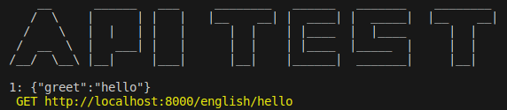

# apitest
simple shell script  to test api



## why apitest?

1. test api without leaving your ide
2. easy customize just edit file apitest.sh
3. lightweight if

## dependecies
- bash  https://git-scm.com/downloads
- curl  https://curl.se/download.html

## getting started
1. download fie https://github.com/nursyah21/apitest/blob/main/apitest.sh
   
3. edit apitest.sh
-  change urlBase
-  change api
-  change total_api

3. run command 
```sh
  bash apitest.sh
```
